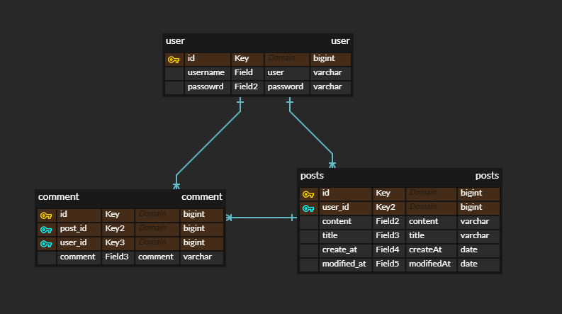
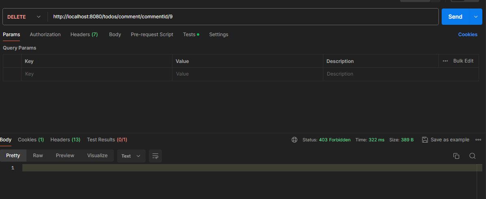
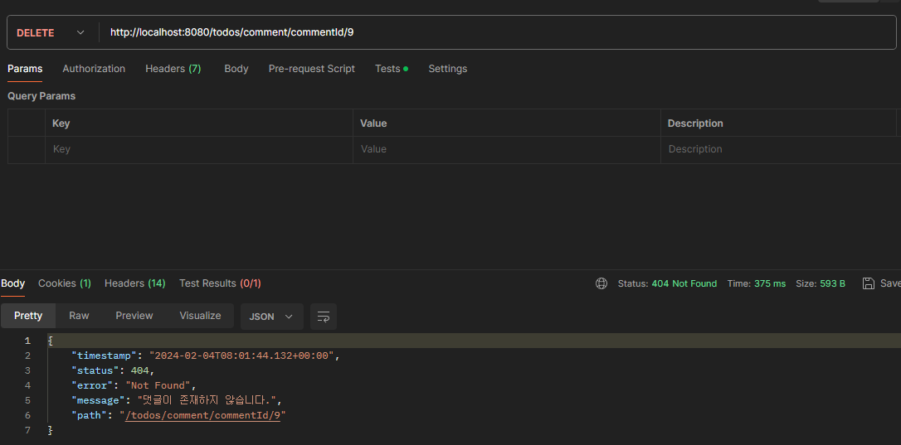

# API 명세서

- https://flossy-cricket-5d0.notion.site/b0f5d432d0334cb3944b7b7c1ad1ba38?v=9ec7bab622804b4ab1f3f92598354a9e&pvs=4

------------

# ERD



------------

# 예외처리

-[x] 토큰이 필요한 api요청에서 토큰을 전달하지 않았거나 정상 토큰이 아닐 때 예외처리

-[x] 토큰은 유효하지만 게시글/댓글 작성자가 아닌 경우에 수정/삭제를 시도할 경우 예외처리

-[x] DB에 이미 존재 하는 username으로 회원가입을 시도할 경우 예외 처리

-[x] 로그인시 전달된 username, password가 DB의 내용과 일치하지 않을 경우 예외처리

------------

# 트러블 슈팅

### 예외가 발생할 시 유효한 유저나 토큰을 소유하였음에도 403에러 발생
1. 문제 발생
 - 
 - 위 사진과 동일하게 적절하게 예외 처리를 했음에도 불구하고 403에러가 계속 발생하는 상황이 생겼다.
   ```
   private Comment validateComment(Long commentId) {
           return commentRepository.findById(commentId)
                   .orElseThrow(() -> new CommentIsEmptyException("댓글이 존재하지 않습니다."));
       }
   ```
   - 위의 코드가 예외가 발생하는 부분이다.
   - 만약에 정말로 403에러인만큼 유효하지 않은 유저인지 확인을 먼저 해봤지만 정말 유효한 유저가 아니라면 처음 request가 filter를 걸치고 service단에 도달하기 전에 인증/인가를 처리하는 filter에서 걸려졌을 것이다.
   - 그렇기에 인증/인가는 적절했음에도 불구하고 403에러를 내뿜는 현상이 발생했다.

2. 해결
   - spring Security에서는 에러가 발생하고 예외를 처리했다면 "/error"라는 uri로 매핑을 시도한다는 것이었다.
   - 그렇기에 처음 인증/인가를 넘어갈 때는 유효한 처리였지만 예외가 발생하여 "/error"로 매핑을 당하게 된다면 한번더 인증/인가가 발생하게 되는 것이었다.
   - 그렇기에 webSecurityConfig에서 "/error"도 permitAll을 추가해줘야 403에러가 뜨지 않는 것이었다.
   ```
   http.authorizeHttpRequests((authorizeHttpRequests) ->
                   authorizeHttpRequests
                           .requestMatchers(PathRequest.toStaticResources().atCommonLocations())
                           .permitAll() // resources 접근 허용 설정
                           .requestMatchers("/todos/**","/error") // "/error" 추가
                           .permitAll()
                           .anyRequest().authenticated() // 그 외 모든 요청 인증처리
           );
   ```
   - 
   - 정상적으로 예외가 잘 응답되는 모습이다.

- 참고 블로그
- https://colabear754.tistory.com/182#%EC%A0%81%EC%A0%88%ED%95%9C_%EC%98%88%EC%99%B8_%EC%B2%98%EB%A6%AC

------------
